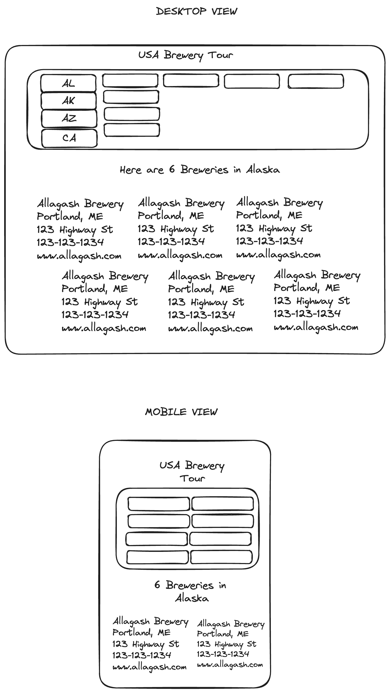

# USA Breweries by State
### By Alex Greenberg

DEPLOYED SITE: [USA Brewery Tour](https://seal-project1.vercel.app/)

## Description of App

> I am creating a US Brewery look-up tool. I will be using the Open Brewery Database API in order for users to click on a State within the USA and a list of 10 breweries will appear on the screen in a randomized fashion. Those outputs will have a title, address, phone number and website!


## Description of API

> The API I am using is an open API with no API-Key needed.

- `https://api.openbrewerydb.org/v1/breweries?by_state=new_york&per_page=5`: This returns a json array with all information regarding the brewery location and contact details


Sample Fetch called:
```
const url = "https://api.openbrewerydb.org/v1/breweries?by_state=new_york&per_page=5"
fetch(url)
.then((res) => res.json())
.then((data) => console.log(data))
```

The data I get back:
```json
[
    {
        "id": "d81ff708-b5d2-478f-af6a-6d40f5beb9ac",
        "name": "12 Gates Brewing Company",
        "brewery_type": "brewpub",
        "address_1": "80 Earhart Dr Ste 20",
        "address_2": null,
        "address_3": null,
        "city": "Williamsville",
        "state_province": "New York",
        "postal_code": "14221-7804",
        "country": "United States",
        "longitude": null,
        "latitude": null,
        "phone": "7169066600",
        "website_url": "http://www.12gatesbrewing.com",
        "state": "New York",
        "street": "80 Earhart Dr Ste 20"
    },
    {
        "id": "ee6d39c6-092f-4623-8099-5b8643f70dbe",
        "name": "16 Stone Brewpub",
        "brewery_type": "brewpub",
        "address_1": "9542 Main St",
        "address_2": null,
        "address_3": null,
        "city": "Holland Patent",
        "state_province": "New York",
        "postal_code": "13354",
        "country": "United States",
        "longitude": "-75.2565195",
        "latitude": "43.24211175",
        "phone": "3158658500",
        "website_url": "http://www.16stonebrewpub.com",
        "state": "New York",
        "street": "9542 Main St"
    },
    {
        "id": "4a09f017-db8f-42e1-a8ec-a0cd81c28761",
        "name": "1940's Brewing Company",
        "brewery_type": "micro",
        "address_1": "1337 Lincoln Ave Unit 1",
        "address_2": null,
        "address_3": null,
        "city": "Holbrook",
        "state_province": "New York",
        "postal_code": "11741-2275",
        "country": "United States",
        "longitude": null,
        "latitude": null,
        "phone": "6315334838",
        "website_url": "http://www.1940sbrewingcompany.com",
        "state": "New York",
        "street": "1337 Lincoln Ave Unit 1"
    },
    {
        "id": "8624d11b-8593-49a8-89b4-c46a0f111cd7",
        "name": "2 Way Brewing Company",
        "brewery_type": "brewpub",
        "address_1": "18 W Main St",
        "address_2": null,
        "address_3": null,
        "city": "Beacon",
        "state_province": "New York",
        "postal_code": "12508-2512",
        "country": "United States",
        "longitude": "-73.9809868",
        "latitude": "41.5082102",
        "phone": "8452027334",
        "website_url": "http://www.2waybrewingcompany.com",
        "state": "New York",
        "street": "18 W Main St"
    },
    {
        "id": "00fdce16-e1dd-4678-87f2-45550f9083e1",
        "name": "212 Brewing Company",
        "brewery_type": "contract",
        "address_1": "21476 Route 23",
        "address_2": null,
        "address_3": null,
        "city": "Davenport",
        "state_province": "New York",
        "postal_code": "13750",
        "country": "United States",
        "longitude": null,
        "latitude": null,
        "phone": "2123779050",
        "website_url": null,
        "state": "New York",
        "street": "21476 Route 23"
    }
]
```

## Mockup

My app will be a table of states where the user can click on the state that is prepopulated in a box up top. Once selected, the brewery information will auto populate with information in a few rows depending on screen size

#### Desktop and Mobile View




## Schedule of Work

|Day | Goal | What I did accomplish |
|----|------|-----------------------|
| Sat | Create Readme, Deploy, Get Approval, Build Fetch and Render Data | |
| Sun | Build pick list for user to interact with ||
| Mon | wrap up functionality ||
| Tues| styling for desktop ||
| Wed | styling for mobile ||
|Thurs| unavailable ||
| Fri | final touches ||
| Sat | Present Project ||